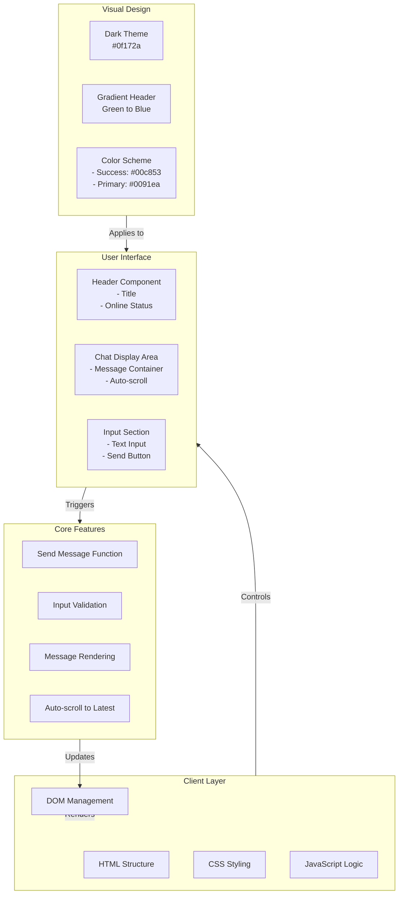
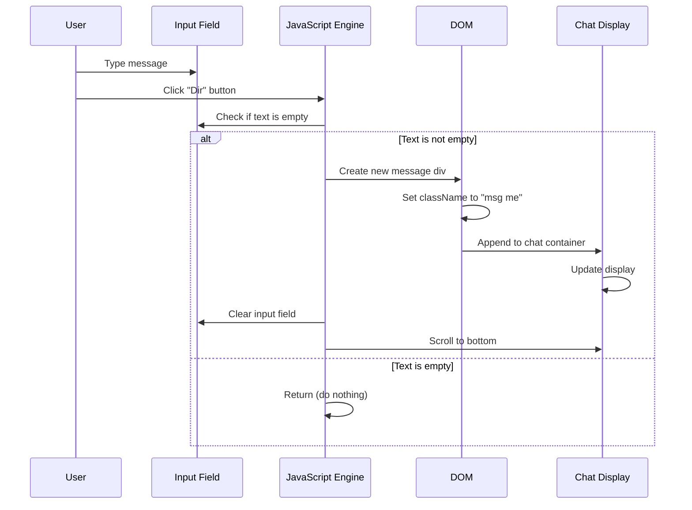
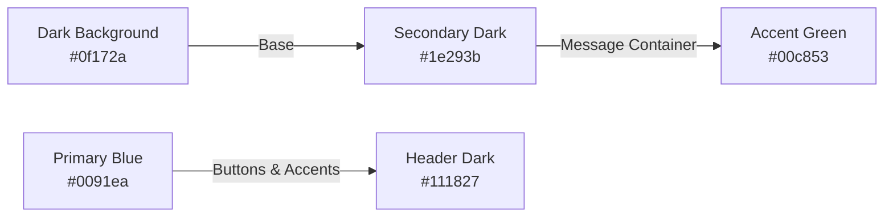

# Zaki Chat Pro - Architecture Overview

## System Architecture



## Component Breakdown

### 1. **Header Component**
- Green to Blue gradient background
- Application title "Zaki Chat Pro"
- Online status indicator (🟢 Green dot)

### 2. **Chat Display Area**
- Scrollable container (75vh height)
- Messages with rounded corners
- User messages (green, right-aligned)
- Bot messages (dark blue, left-aligned)
- Auto-scroll to latest message

### 3. **Input Section**
- Text input field for messages
- "Dir" (Send) button
- Responsive flex layout

### 4. **Message Flow**



## Styling Architecture

### Color Palette


## File Structure

```
zaki/
├── index.html          # Main application file
├── docs/
│   └── architecture.md # This file
└── README.md           # Project documentation
```

## Technology Stack

| Component | Technology |
|-----------|-----------|
| **Frontend** | HTML5 |
| **Styling** | CSS3 (Flexbox, Gradients) |
| **Scripting** | JavaScript (Vanilla) |
| **DOM API** | Native Browser APIs |
| **Language Support** | Somali (Af-Soomaali) |

## Key Functions

### `sendMsg()`
```javascript
// Retrieves user input
// Validates against empty strings
// Creates DOM element for message
// Appends to chat container
// Clears input field
// Auto-scrolls to latest message
```

## Features

✅ Real-time message sending  
✅ User input validation  
✅ Auto-scroll functionality  
✅ Responsive design  
✅ Dark theme with gradient header  
✅ Color-coded user vs bot messages  
✅ Online status indicator  
✅ Somali language support  

## Future Enhancements

- [ ] Backend API integration for persistent storage
- [ ] User authentication
- [ ] Typing indicators
- [ ] Message timestamps
- [ ] User avatars
- [ ] Message reactions/emojis
- [ ] Chat history
- [ ] Dark/Light theme toggle
- [ ] Mobile responsiveness improvements
- [ ] Accessibility features (ARIA labels, keyboard navigation)

---

**Created**: 2026-06-08  
**Application**: Zaki Chat Pro  
**Version**: 1.0  
**Status**: ✅ Active Development
