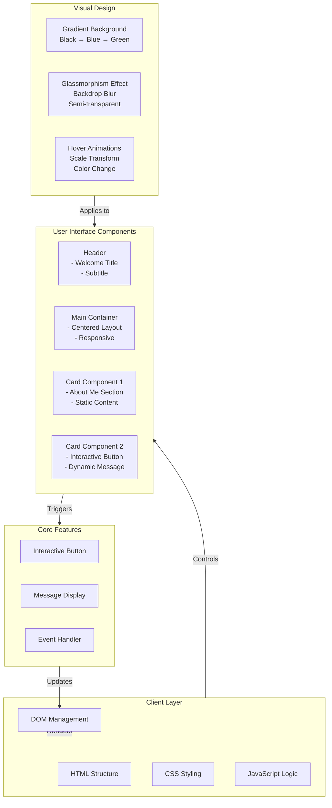
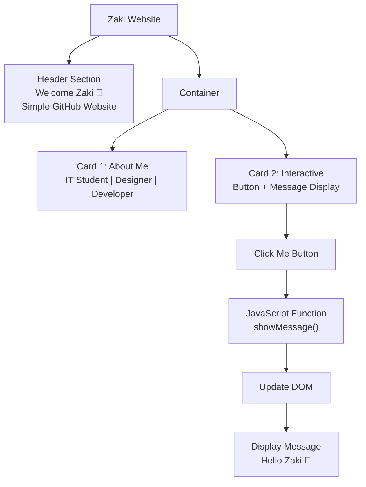
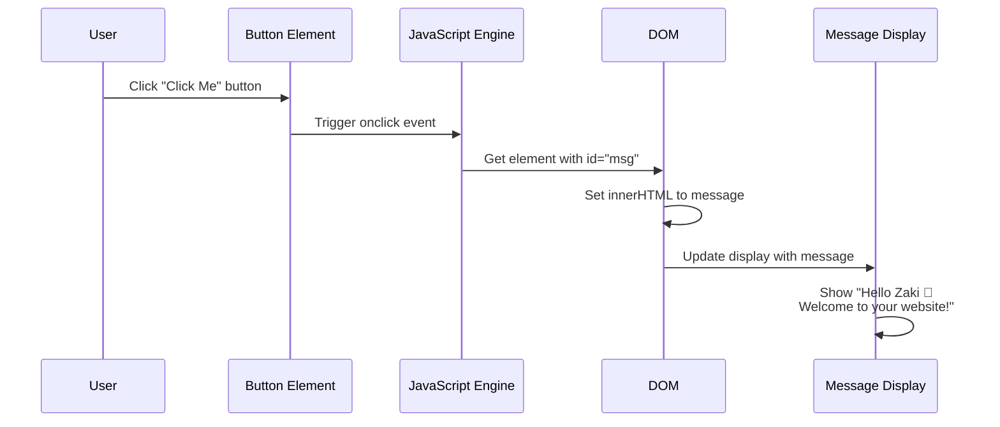
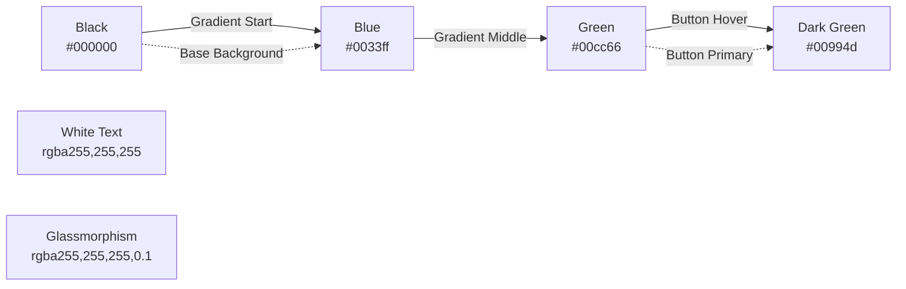

# Zaki Website - Architecture Overview

## System Architecture



## Page Layout



## Component Breakdown

### 1. **Header Section**
- **Title**: "Welcome Zaki 🚀"
- **Subtitle**: "Simple GitHub Website"
- **Styling**: Centered, white text on gradient background

### 2. **Card Component 1 - About Me**
- Displays personal information
- Static content (IT Student | Designer | Developer)
- Glassmorphism design with blur effect

### 3. **Card Component 2 - Interactive**
- "Click Me" button
- Dynamic message display
- Event-driven interaction

### 4. **Interaction Flow**



## Styling Architecture

### Color Palette


### CSS Features
- **Gradient Background**: 135-degree linear gradient (Black → Blue → Green)
- **Backdrop Filter**: 10px blur for glassmorphism effect
- **Box Shadow**: Subtle shadow with 15px blur
- **Hover Effects**: Scale transform (1.1x) + color change
- **Smooth Transitions**: 0.3s transition on button hover

## File Structure

```
zakimoha7788-debug/Zaki/
├── index.html              # Main website file
├── docs/
│   ├── architecture.md     # Chat Pro architecture
│   └── website-architecture.md # This file
└── README.md               # Project documentation
```

## Technology Stack

| Component | Technology |
|-----------|-----------|
| **Frontend** | HTML5 |
| **Styling** | CSS3 (Gradients, Glassmorphism, Animations) |
| **Scripting** | JavaScript (Vanilla) |
| **DOM API** | Native Browser APIs |
| **Design Pattern** | Responsive, Mobile-friendly |

## Key Functions

### `showMessage()`
```javascript
function showMessage(){
    // Targets the message paragraph element
    // Updates innerHTML with welcome message
    // Displays on button click
    document.getElementById("msg").innerHTML =
    "Hello Zaki 👋 Welcome to your website!";
}
```

## Features

✅ Modern gradient background  
✅ Glassmorphism UI design  
✅ Responsive layout  
✅ Interactive button with hover effects  
✅ Dynamic message display  
✅ Smooth animations and transitions  
✅ Mobile-friendly design  
✅ Professional appearance  

## Responsive Design

```
Desktop (max-width: 500px):
┌─────────────────────┐
│   Welcome Zaki 🚀  │
│ Simple GitHub Ws... │
├─────────────────────┤
│   About Me Card     │
├─────────────────────┤
│ Interactive Button  │
│    [Click Me]       │
│    Message Area     │
└─────────────────────┘
```

## Future Enhancements

- [ ] Add more portfolio sections
- [ ] Project showcase gallery
- [ ] Skills section with progress bars
- [ ] Contact form with validation
- [ ] Social media links
- [ ] Dark/Light theme toggle
- [ ] Smooth scroll navigation
- [ ] Animated counters
- [ ] Blog section
- [ ] SEO optimization
- [ ] Analytics integration
- [ ] Multiple language support

## Browser Compatibility

| Browser | Support |
|---------|---------|
| Chrome | ✅ Full |
| Firefox | ✅ Full |
| Safari | ✅ Full |
| Edge | ✅ Full |
| Mobile Browsers | ✅ Full |

---

**Created**: 2026-06-08  
**Project**: Zaki Website  
**Version**: 1.0  
**Status**: ✅ Active Development
